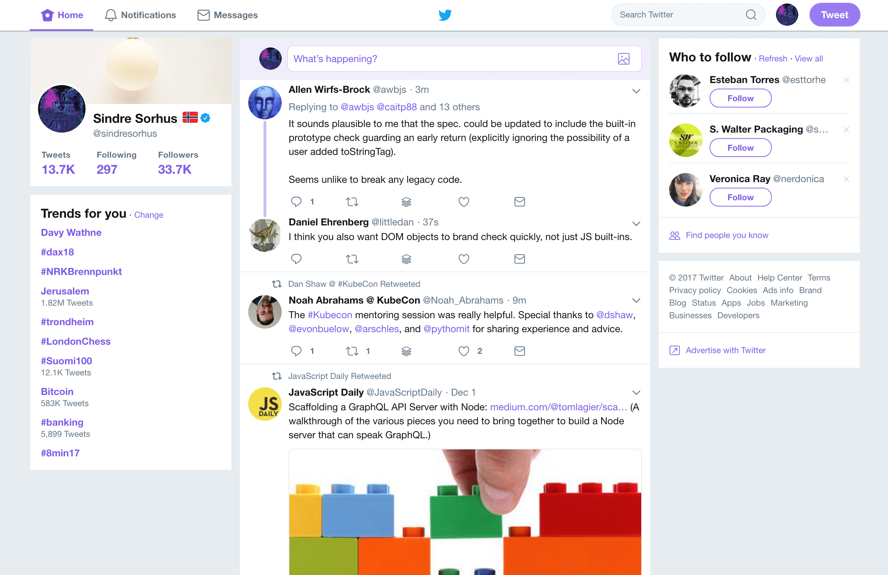

# Refined Twitter

> Browser extension that simplifies the Twitter interface and adds useful features

We use Twitter a lot and notice many dumb annoyances we'd like to fix. So here be dragons.

**Read the [blog post](https://blog.sindresorhus.com/refined-twitter-74038424fe2a) and discuss it on [Product Hunt](https://www.producthunt.com/posts/refined-twitter)**


## Install

- [**Chrome** extension](https://chrome.google.com/webstore/detail/refined-twitter/nlfgmdembofgodcemomfeimamihoknip)
- **Firefox** add-on: Use [this](https://addons.mozilla.org/en-US/firefox/addon/chrome-store-foxified/) to enable installing Chrome extensions and then install [Refined Twitter](https://chrome.google.com/webstore/detail/refined-twitter/nlfgmdembofgodcemomfeimamihoknip)
- **Opera** extension: Use [this](https://addons.opera.com/en/extensions/details/download-chrome-extension-9/) to enable installing Chrome extensions and then install [Refined Twitter](https://chrome.google.com/webstore/detail/refined-twitter/nlfgmdembofgodcemomfeimamihoknip)


## Highlights

- Simplified and improved UI.
- Hides promoted tweets.
- Auto-loads new tweets in the stream if you're scrolled to the top. No more clicking `See 3 new Tweets`!
- Fixes the file extension when saving images in tweets. No more `foo.jpg_large`!
- Uses the system font.
- [Embeds the photo from Instagram links directly in the tweet.](https://user-images.githubusercontent.com/170270/34315380-12d52994-e77f-11e7-8e23-27b76aee4df2.png)
- Improves performance. [1](https://github.com/sindresorhus/refined-twitter/pull/14) [2](https://github.com/sindresorhus/refined-twitter/commit/23897e251d2bc8d59526129ce54c7a5bf1ef884c)
- Hides "Liked" tweets in the stream.
- [Syntax highlighting in code blocks.](https://github.com/sindresorhus/refined-twitter/issues/37)
- Uses the original image in tweet image galleries instead of a downsized version.
- [Removes the annoying suggestions in the search popover.](https://user-images.githubusercontent.com/170270/33800304-70198358-dd3d-11e7-9870-477a44f74f4d.png)
- Hides "Notifications" activity for new followers and being added to a list.
- Prevents DM modal from closing when (accidentally) clicking outside the modal.
- Highlight your mentions in the stream
- [Adds a `Likes` button to the main navbar](https://user-images.githubusercontent.com/14620121/35988497-ace9f93e-0ce5-11e8-8675-17e6ee38cd99.png)
- Keyboard shortcut to toggle Night Mode (<kbd>Alt</kbd><kbd>m</kbd>).
- [Adds Markdown-like styling of `text wrapped in backticks`](https://user-images.githubusercontent.com/12901172/38168571-d9bd82ea-351d-11e8-9858-0d7c8993cdd3.png)
- Uses your personal color theme on all profiles.

Tip: Twitter has a native [dark mode](https://github.com/sindresorhus/refined-twitter/issues/10) and you can toggle it using <kbd>Alt</kbd><kbd>m</kbd>. And press <kbd>Shift</kbd> <kbd>?</kbd> to see all keyboard shortcuts.




## Customization

We're happy to receive suggestions and contributions, but be aware this is a highly opinionated project. There's a very high bar for adding options.

This doesn't necessarily limit you from manually disabling functionality that is not useful for you. Options include:

1. *(CSS Only)* Use a Chrome extension that allows injecting custom styles into sites, based on a URL pattern. [Stylish](https://chrome.google.com/webstore/detail/stylish/fjnbnpbmkenffdnngjfgmeleoegfcffe?hl=en) is one such tool. [Example](https://github.com/sindresorhus/refined-github/issues/136#issuecomment-204072018)

2. Clone the repository, make the adjustments you need, and [load the unpacked extension in Chrome](https://developer.chrome.com/extensions/getstarted#unpacked), rather than installing from the Chrome Store.


## Contribute

Suggestions and pull requests are highly encouraged!

In order to make modifications to the extension you'd need to run it locally.

Please follow the below steps:

```sh
git clone https://github.com/sindresorhus/refined-twitter
cd refined-twitter
npm install    # Install dev dependencies
npm run build  # Build the extension code so it's ready for the browser
npm run watch  # Listen for file changes and automatically rebuild
```

Once built, load it in the browser of your choice:

<table>
	<tr>
		<th>Chrome</th>
		<th>Firefox</th>
	</tr>
	<tr>
		<td width="50%">
			<ol>
				<li>Open <code>chrome://extensions</code>
				<li>Check the <strong>Developer mode</strong> checkbox
				<li>Click on the <strong>Load unpacked extension</strong> button
				<li>Select the folder <code>refined-twitter/distribution</code>
			</ol>
		</td>
		<td width="50%">
			<ol>
				<li>Open <code>about:debugging#addons</code>
				<li>Click on the <strong>Load Temporary Add-on</strong> button
				<li>Select the file <code>refined-twitter/extension/manifest.json</code>
			</ol>
		</td>
	</tr>
</table>


## FAQ

### Don't you have another extension with the same name?

This is reusing the name from the [original Refined Twitter](https://github.com/sindresorhus/refined-twitter-old) extension, which tried to use the mobile Twitter version on the desktop. It was a good idea in theory, but not in practice. This extension instead improves upon the desktop version of Twitter.


## Related

- [Refined GitHub](https://github.com/sindresorhus/refined-github) - GitHub version of this extension


## Maintainers

- [Sindre Sorhus](https://github.com/sindresorhus)
- [Filipe Kiss](https://github.com/filipekiss)


## License

MIT
